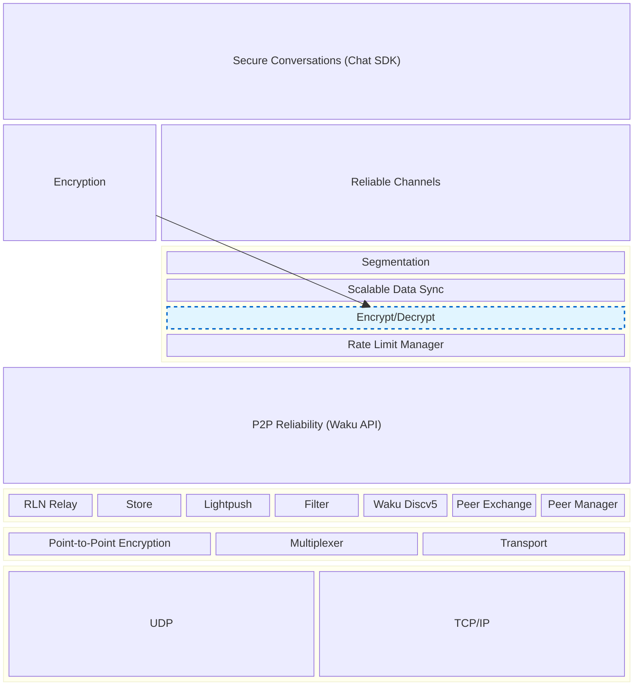

# Waku Architecture

An overview of the Waku architectures target, include the various layer and APIs.
This is an update of the [Reliablity and Waku API](https://blog.waku.org/2024-06-20-message-reliability/) article

