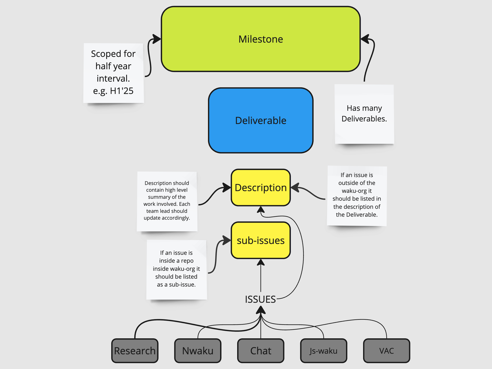
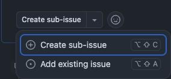
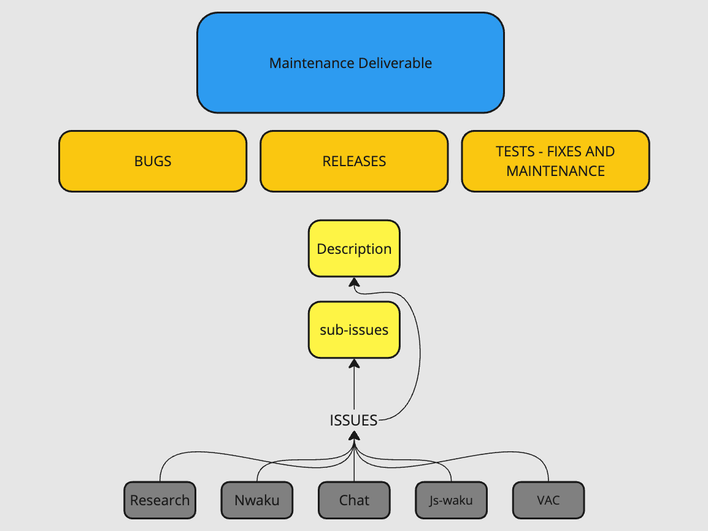

# Waku Project Management

## Teams

The Waku Team is comprised of the following subteams:

- Waku Research
- Waku Development: nwaku, js-waku
- Waku Chat

*For tracking and project management processes please see* [PROCESS.md](./PROCESS.md)

## Reporting Guidelines

### Weekly Reporting

Weekly reporting provides an insight on the progress by Milestones. Updates are published to https://roadmap.logos.co/tags/waku-updates.

- Updates are collected and submitted by the team leads.
- Add to the relevant pull request in the roadmap repository: https://github.com/logos-co/roadmap/pulls
- Provide updates for each Deliverable currently in-progress.
- Use the achieved, next, blockers format templated under each Deliverable.
- Indicate if there is a scope change or due date change.
- Use the [Maintenance Deliverable](https://github.com/waku-org/pm/issues/275) for Maintenance, Tests, and Bugs that do not have a parent Milestone or Deliverable.
- Indicate which team the update is for, e.g.:
```md
    - achieved:
        - [nwaku] Added testing for…
        - [chat] Update libraries in…
```

## Milestones

Milestones are defined in the Waku roadmap and tracked as Github in this repo.
Roadmap: https://roadmap.logos.co/waku/waku-milestones
Github: https://github.com/waku-org/pm/milestones



## Deliverables

### Creation

If a Deliverable has not yet been created, the Lead for the sub-team scheduled to kick-off the work. All Deliverables should be created in the Waku PM repo: https://github.com/waku-org/pm

You can use the Deliverable template: https://github.com/waku-org/pm/issues/new?template=deliverable.md

Upon creation of a Deliverable in Github please notify the PM.

### Assignees

For each team involved in work for the Deliverable, the Lead for that team should be an assignee on the Deliverable.

### Adding sub-issues

Create or add sub issues to the deliverable by using Github’s new “sub-issue” feature:



## Maintenance Deliverable

This Maintenance Deliverable tracks all work not specifically described in the Waku roadmap covering Maintenance, Bugs, and Tests.

[2025 H1 Maintenance Deliverable](https://github.com/waku-org/pm/issues/275)

