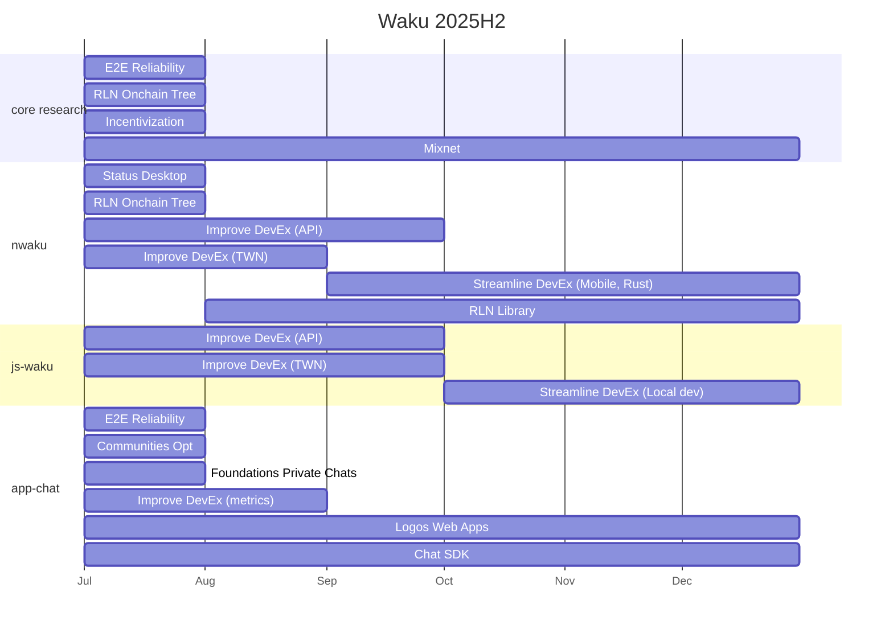

# Waku Draft Roadmap

Finalised roadmap and milestones can be found on the [Logos roadmap](https://roadmap.logos.co/waku/).

Period in planning: 2025 H2

## Proposed Priorities

### Whole Team

1. **Support Status application**: continue integration of nwaku and provide new chat protocol stack. 
2. **Support Logos Core**: ensure that any library and API we push to developers can be consumed in Logos Core; review and prioritize any requirements coming from Logos Core project contributors and developers.
3. **Developer and Contributor Experience:** Review and improve dev assets (docs) and set quality expectation across the team (docs provided with deliverables, etc); Review and take action to improve developer and contributor experience (nimble usage, vscode plugin, etc).

### Core Team

1. **Complete integration of nwaku in Status Desktop**.
2. **Simplify a reliable Waku API:** aka Messaging API, make it easier to consume Waku library; critical to enable easy development of Chat SDK.
3. **Upgrade Waku for the Web**: Ensure web applications built on The Waku Network are reliable.
4. **RLN mainnet and API:** Continue RLN migration to onchain tree + L2 testnet, and necessary steps to get RLN on mainnet; provide simple API for Chat SDK.
5. **[Nwaku in Status Mobile and Light Mode MVP](https://github.com/waku-org/pm/milestone/39)**: de-prioritised in favour of cleaning up Waku and RLN APIs for Chat SDK first.
6. **nwaku performance improvement**: Performance on mobile is critical, hence we will review benchmarks and potentially dedicate effort to this topic
(note there is some ongoing effort from Status fleet behaviour).

#### Research Items

1. RLN (as above)
2. **Incentivisation:** Deliver incentivisation PoC for reliability, scalability, risk (running own fleet) and sustainability.
3. **Decentralisation and privacy**: continue research work to further decentralised Waku protocols, specifically store, and increase anonymity properties with libp2p-mixnet

### Chat/App Team

1. **Chat SDK:** Build a chat SDK (new protocol), learning from Status’ experience. Focus for an iterative delivery of the foundational blocks. Targeting private chats and early RLN integration.
   1. Note that building blocks such as identity mgmt are being built for demos app like Qaku - alignment to define and provide common protocols is expected as we are not limited by existing Status chat protocol.
   2. Work in close partnership with the status-backend developers, to ensure that post-refactoring the SDK can be integrated with the least effort possible. Aim for early and iterative integration.
   3. Note that early Status backend design position chat SDK as backend for Communities too; early iteration may not provide the scale in terms of members per communities; but Status' requirement is noted. 
   4. Minimum deliverable will be usability of Chat SDK in Logos Core; need to review the architecture expectation in terms of Logos Core plugin interaction chat sdk <> nwaku.
2. **Build demos and PoC apps**: Continue building PoC apps to teach how to hunt, dogfood and battle test libraries; as well as throwing ideas in the wild, experimenting and seeing what sticks; promising apps will have lib and specs implemented (e.g. Qaku and Logos Forum).
   1. Potentially expand the relevant platforms: from Web to Logos core, Nim/seaqt, Rust, etc.
   2. Integration with Codex still planned under this umbrella
   3. Review Logos Forum (Opchan) requirements; the 2025 Logos Movement Strategy is the new customer.

### Business and Ecosystem Development Team (BD + Solution Eng)

1. **Measure Success:** Develop and deploy tools to measure Waku success in terms of users, developers and contributors across all known Waku networks (Status, RAILGUN, TWN, etc)
    1. In partnership with BI.
2. **Waku Chat MVP:** Proceed with the same exercise done for [Waku MVP](https://www.notion.so/Waku-MVP-1838f96fb65c8039acabf8a6a1e689e7?pvs=21).
   Consult with current and new leads on their *ideal* Chat SDK.
   Understand how confident we are they would onboard on Waku if it is delivered and feedback to Chat/App team to take in account for prioritization.
3. **Support integrations**: support projects that want to build with Waku SDK and Chat SDK. 
4. **Foster and join Nim ecosystem (nwaku):** Foster and participate in the Nim developer community inside and outside IFT.
5. **Join FOSS ecosystem:** Be an active part of the FOSS developer community.
6. **Continue planned Rust SDK work**: Messaging API and stable nwaku integration in Status Desktop and pre-requisites to a quality Rust SDK.

### Status Priorities Review

**Existing milestones**:

- [Hardening and Scaling Foundations for Private Chats](https://roadmap.logos.co/waku/milestones/open/2025-hardening-and-scaling-foundations-for-private-chats): finishing off the work and descoping items that have been identified as unneeded.
- [Nwaku in Status Desktop (Relay only)](https://roadmap.logos.co/waku/milestones/open/2024-nwaku-in-status-desktop): work continues, close to completion. 
- [Nwaku in Status Mobile](https://roadmap.logos.co/waku/milestones/open/2025-nwaku-in-status-mobile): deprioritized in favour of improving API for new Chat SDK
- [e2e reliability protocol](https://roadmap.logos.co/waku/milestones/open/2024-e2e-reliability-protocol): work continues, close to completion.
- [Foundation for Communities Optimization](https://github.com/waku-org/pm/milestone/31): this includes finishing a migration, and move community traffic away from 1:1 chat so we complete the work.

**New work and priorities**:

1. New Chat SDK (nim) and protocol stack

## Draft Milestones

Testing out new format, once approved:

- Milestones are moved to Logos roadmap
- Deliverables are moved to GitHub issues
- Waku FURPS remains in [FURPS](/FURPS/README.md)

1. [Introduce E2E Reliability in Status Communities](./introduce_e2e_reliability_in_status.md)
2. [Foundation for Communities Optimisation](/draft-roadmap/foundation_for_communities_optimisation.md)
3. [Hardening and Scaling Foundations for Private Chat](/draft-roadmap/hardening_and_scaling_foundation_for_private_chat.md)
4. [Integrate nwaku in Status Desktop, relay mode only](/draft-roadmap/integrate_nwaku_in_status_desktop_relay_mode_only.md)
5. [Deploy RLN Onchain Tree on L2 Testnet](/draft-roadmap/deploy_rln_onchain_tree_on_l2_testnet.md)
6. [Define Incentivisation for RLNaaS](/draft-roadmap/define_incentivisation_for_rlnaas.md)
7. [Improve DevEx: API, TWN, Metrics, Docs](/draft-roadmap/improve_devex_api_twn_metrics_docs.md)
8. [Introduce mixnet for message sending]() TODO: refining definition with @jm-clius. Suggesting mixnet relay deployed on TWN + light push over mixnet available in nwaku cli.
9. [Formalize Logos Web Apps](/draft-roadmap/formalize_logos_web_apps.md)
10. [Introduce Chat SDK by enabling basic one-to-one chats]() TODO: should be added via https://github.com/waku-org/pm/pull/303
11. [Integrate RLN with Waku API](/draft-roadmap/integrate_rln_with_waku_api.md)
12. [Streamline DevEx: Mobile, Rust and Web dev](/draft-roadmap/streamline_dev_ex_local_dev_rust.md)
13. Incentivization follow-up

Pushed to 2026
- WebTransport: depending on nim-libp2p (delivery Q4)
- REST API for Waku API: Useful for DST/QA, but let's focus on Status, Chat SDK, and Rust first

Not yet planned/not sure:
- nwaku performance on mobile: let's focus on finishing desktop integration and getting API ready for Chat SDK + RLN 
- quic: need to review where to put it, should be easy.
- Follow-up steps for incentivization: part of current milestone is to produce a roadmap.

### Business Development Milestones

TODO

## Gantt

TODO: fix dates

